# Top 12 AI Research Assistant Tools in 2025 (Latest Updated)

Finding the right sources used to mean endless scrolling through databases and drowning in browser tabs. Now AI research assistants do the heavy lifting—summarizing papers, mapping citations, and helping you write faster without losing your sanity. These tools handle everything from literature reviews to automated note-taking, so you can focus on the actual thinking instead of digital housekeeping.

Whether you're a grad student racing against deadlines, a researcher managing hundreds of papers, or an analyst synthesizing complex reports, the right AI tool transforms chaos into clarity. The platforms below excel at different aspects of research workflows—some shine at summarization, others at visualization, and a few handle the entire pipeline from collection to final draft.

***

## **[Otio](https://otio.ai)**

Your all-in-one workspace where research materials actually talk to each other instead of sitting in isolated folders.

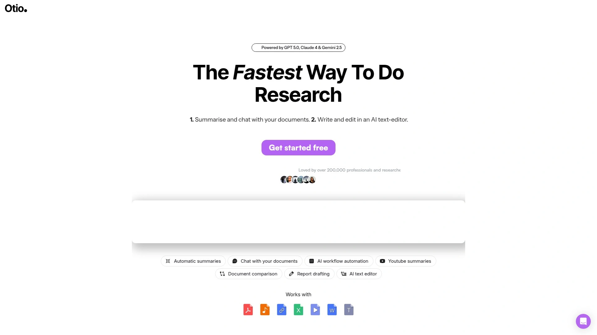

Otio handles the complete research lifecycle—from collecting sources across YouTube videos, PDFs, and web articles to generating AI summaries and writing your final draft. The platform automatically extracts key takeaways from any content you bookmark, creating detailed notes that serve as references when drafting papers or essays. You can chat directly with your documents using source-grounded Q&A, getting answers that cite specific passages rather than vague summaries.

The AI text editor understands context from your collected sources, helping you outline and draft without the constant tab-switching nightmare. Users particularly love the automation builder for repetitive workflows—instead of copy-pasting prompts into generic chatbots, you create custom automations that save hours every week. Document comparison features let you analyze multiple sources simultaneously, and the interface stays intuitive even when you're managing 700+ bookmarks.

Researchers report significantly better citation quality compared to standard AI tools, with real text citations that link directly to source material. The podcast and video summarization feature alone justifies the subscription for anyone drowning in multimedia content.

***

## **[ResearchRabbit](https://www.researchrabbit.ai)**

Think Spotify recommendations, but for academic papers—the more you save, the smarter it gets at finding exactly what you need.

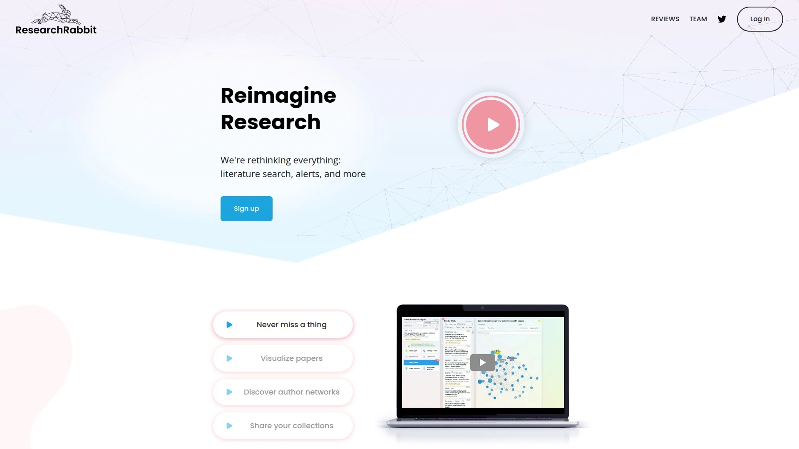

ResearchRabbit builds citation networks from seed papers you provide, then visualizes how research connects through backward and forward citations. Instead of manually tracking down references, you add a few relevant papers to a collection and the tool automatically suggests similar work, earlier foundational studies, and later derivative research. The AI learns your preferences with each addition, continuously refining recommendations without requiring keyword gymnastics.

The visual citation maps help you spot influential works immediately—bubble size represents citation count while color indicates publication year, making it easy to identify landmark papers and recent developments at a glance. You can explore specific authors' networks, set alerts for new papers in your field, and collaborate by sharing collections with teammates.

Integration with Zotero means seamless export of references for citation management. The timeline view shows how research themes evolved over decades, and the network visualization reveals hidden connections between papers that don't directly cite each other. Always free for researchers, which is rare for tools this powerful.

***

## **[SciSpace](https://typeset.io)**

Turns dense academic jargon into plain English explanations without opening 47 new tabs for every unfamiliar concept.

SciSpace uses semantic search to find papers based on questions rather than keywords, understanding what you're actually looking for instead of just matching terms. The database contains 282 million papers that the AI cross-references when answering research questions. You can highlight any technical language, math equations, or complex tables in PDFs and get instant simplified explanations—the tool even translates across 13 languages.

The Literature Review tool provides answers synthesized from hundreds of millions of sources, complete with citations showing exactly where information came from. You can scan your existing PDF collection for specific criteria using AI, saving hours of manual screening. Custom columns let you extract particular details from multiple papers simultaneously, like methodology or sample sizes, organized in structured tables.

The Chrome extension works on any website, letting you interact with research papers and technical blogs wherever you're reading. Follow-up questions dig deeper into concepts without losing context, and related paper suggestions appear when you highlight passages. The AI Writer component helps draft research proposals grounded in the literature you've collected.

***

## **[Consensus](https://consensus.app)**

Synthesizes answers exclusively from peer-reviewed journals, so you're building arguments on evidence-based research rather than internet speculation.

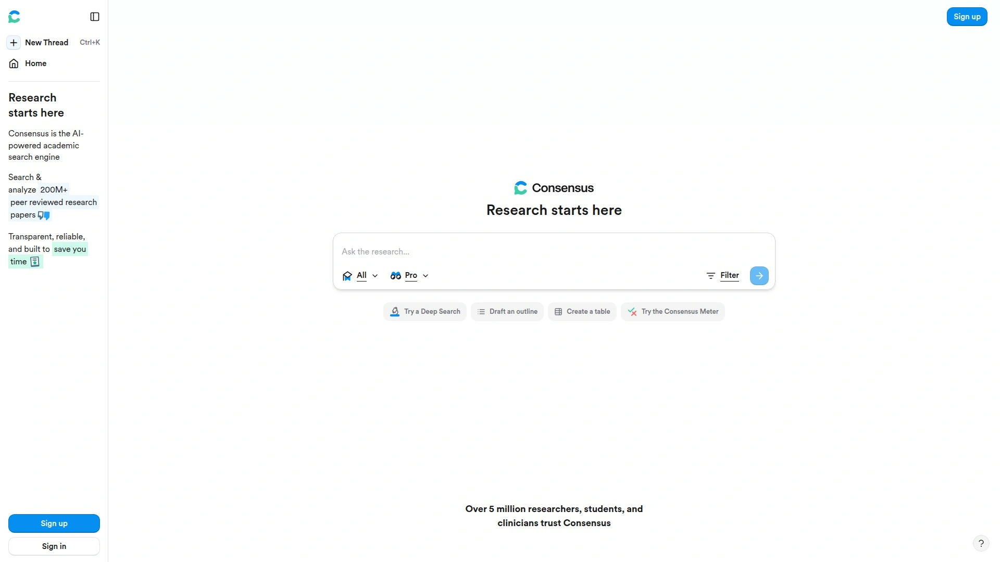

Consensus specializes in scientific research by pulling data only from peer-reviewed sources, using semantic search to understand query context beyond simple keyword matching. When you ask about a research topic, it generates detailed summaries showing exactly which papers support or contradict various claims. The results display author names, journal titles, citation counts, analysis types, and credibility indicators for each source.

Filters let you narrow results by publication year, exclude preprints, or focus on open-access papers and highly-cited works. The tool excels at questions requiring evidence-based answers, making it ideal for hypothesis testing and systematic literature reviews. Every synthesized answer includes references with clear links to the original research, eliminating the trust issues plaguing generic AI tools.

The platform works best for science-based disciplines where peer-reviewed literature forms the foundation of acceptable evidence. Paid plans start at $11.99 monthly, but the free tier provides substantial functionality for students and early-stage researchers.

---

## **[NotebookLM](https://notebooklm.google.com)**

Google's research assistant that transforms your uploaded sources into study guides, briefings, and even audio overviews for learning on the go.

NotebookLM leverages Gemini's advanced AI to process PDFs, websites, YouTube videos, audio files, Google Docs, and Slides in over 50 languages. You chat with your notebook to get information grounded in your specific sources, with inline citations ensuring accuracy and transparency. The tool generates study guides, executive briefings, mind maps, and other formats tailored to how you need to consume information.

The audio overview feature stands out—it converts written sources into conversational summaries you can listen to during commutes or workouts. All responses cite exact locations in your source materials, so you can verify claims without hunting through documents. The interface handles complex reasoning across text, graphs, images, and audio within the same workflow.

Available free to users over 13 in 180+ regions where Gemini operates, with stricter content policies for users under 18. Workspace for Education accounts have access for users of all ages, making it practical for both research institutions and individual scholars.

---

## **[Elicit](https://elicit.com)**

Automates the soul-crushing parts of systematic reviews by extracting data from dozens of papers and organizing everything into clean tables.

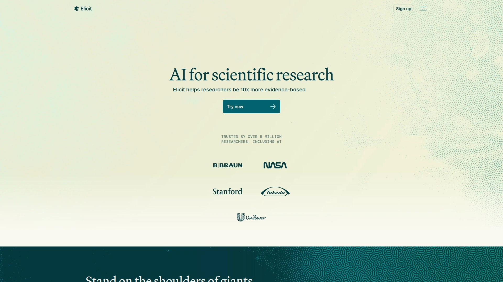

Elicit finds relevant academic papers from 138 million+ sources even without perfect keyword matches, then extracts specific information you define—population sizes, methodologies, study limitations, funding sources, anything. The data extraction accuracy reportedly exceeds human extractors in many cases, presenting results in structured tables you can customize. Every claim links to the exact sentence in the source paper where it originated, eliminating the verification nightmare.

The tool automates screening and data extraction for systematic reviews, with researchers reporting up to 80% time savings. You can upload your own PDFs and analyze them alongside database papers, or use the Research Report feature to automatically generate comprehensive briefs based on selected papers. The notebook functionality helps organize extracted findings with tags and custom columns.

Elicit integrates with Zotero for citation management and supports automated synthesis for meta-analyses. The platform focuses specifically on academic workflows rather than general research, making it powerful but specialized. Freemium pricing starts around $10-12 monthly for enhanced features.

***

## **[Semantic Scholar](https://www.semanticscholar.org)**

Surfaces the most influential papers in a field using AI to identify hidden connections that traditional search engines miss completely.

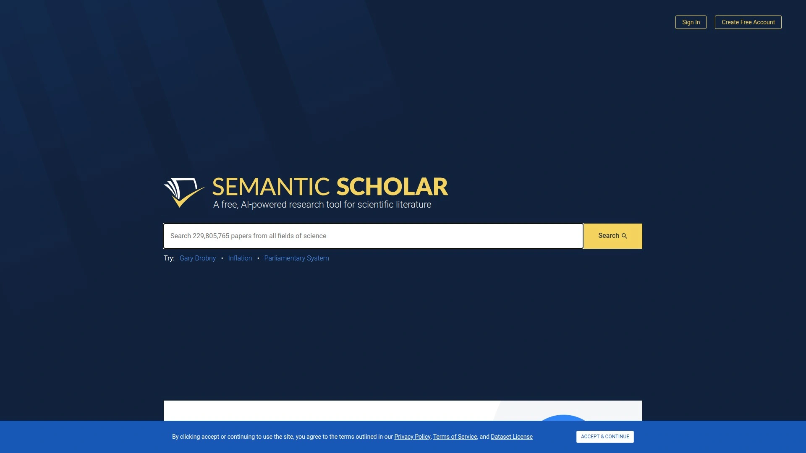

Semantic Scholar applies natural language processing and machine learning to over 200 million scientific publications across all disciplines. Unlike basic citation trackers, it highlights the most important and influential elements within papers using AI-trained models. The platform generates one-sentence TLDR summaries automatically, making it easy to screen papers on mobile devices.

Research Feeds uses adaptive AI recommenders that learn what papers you care about and suggests the latest relevant work to keep you current. Semantic Reader provides in-line citation cards with auto-generated summaries as you read, plus skimming highlights that capture key points for faster digestion. The tool exploits graph structures from Microsoft Academic, Springer Nature's SciGraph, and its own corpus to reveal connections between research topics.

Free to use without paywalls, and you don't need an account to search—though creating one enables alerts and saved searches. Results filter by subject area, date range, author, publication venue, and PDF availability. The semantic search understands context by examining word relationships rather than requiring Boolean operators.

***

## **[Scite](https://scite.ai)**

Shows whether other papers support, contradict, or just mention each citation—critical context for evaluating research credibility.

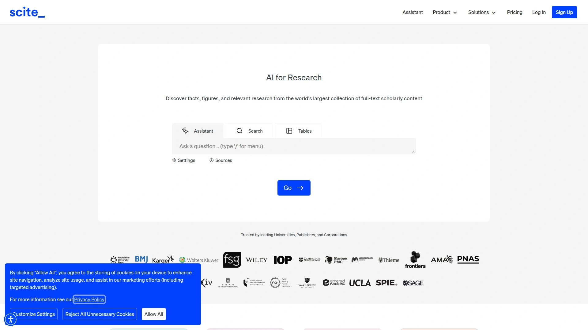

Scite analyzes citation context using machine learning to classify whether papers support, contrast, or simply mention the works they cite. The database contains over 1.2 billion citations and 185 million full-text articles, letting you check Smart Citation metrics at the article, journal, organization, or funder level. This helps you evaluate which papers are genuinely influential versus merely frequently cited.

The browser extension displays Smart Citations anywhere you're reading scientific articles online, providing immediate context without leaving the page. Students can ask research questions in plain language and get answers pulled directly from full-text articles rather than abstracts. The reporting feature compiles citation statements showing what's being said about specific publications.

The tool helps identify retracted papers and understand how they're still being cited in current literature—useful for avoiding reliance on discredited research. While scite occasionally misclassifies citation types (particularly supporting versus mentioning), it provides valuable quick context for literature evaluation. Academic institution subscriptions provide full access, with limited free functionality available.

***

## **[Scholarcy](https://www.scholarcy.com)**

Generates plain-language summaries from any academic article or textbook, then structures them into interactive sections you navigate at your own pace.

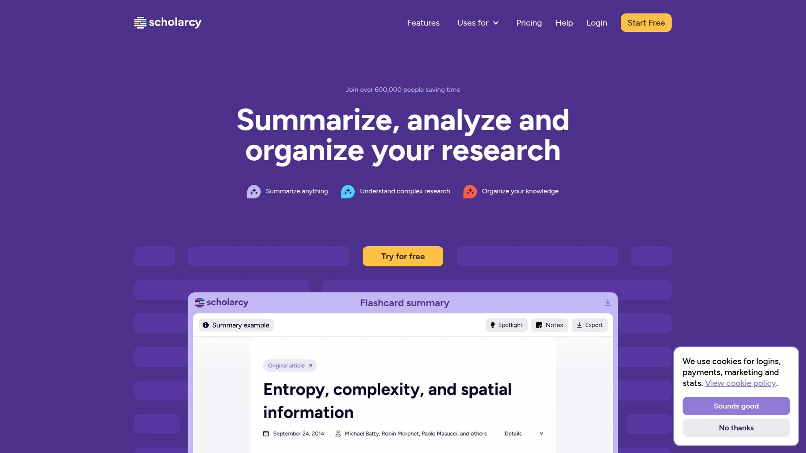

Scholarcy transforms dense papers into structured summaries starting with a snapshot overview for quick screening, followed by five key findings highlighting main takeaways. The enhanced summary feature lets you adjust reading style in one click, customizing how information is presented. Objectives, methods, results, and conclusions appear in separate navigable sections rather than one overwhelming block of text.

The bulk article summarizer processes multiple papers simultaneously, saving time when you need to screen dozens of sources for relevance. Interactive summaries maintain links to original content, so you can verify claims without hunting through the full text. Over 600,000 students and researchers use the platform for faster literature screening and comprehensive understanding.

The tool excels at breaking down complex technical language into accessible explanations without oversimplifying core concepts. You can export summaries or use them as starting points for your own notes and annotations. Free trial available at library.scholarcy.com/try, with paid plans for power users managing large literature collections.

---

## **[Connected Papers](https://www.connectedpapers.com)**

Creates visual graphs of paper relationships using co-citation and bibliographic coupling, revealing the research landscape at a glance.

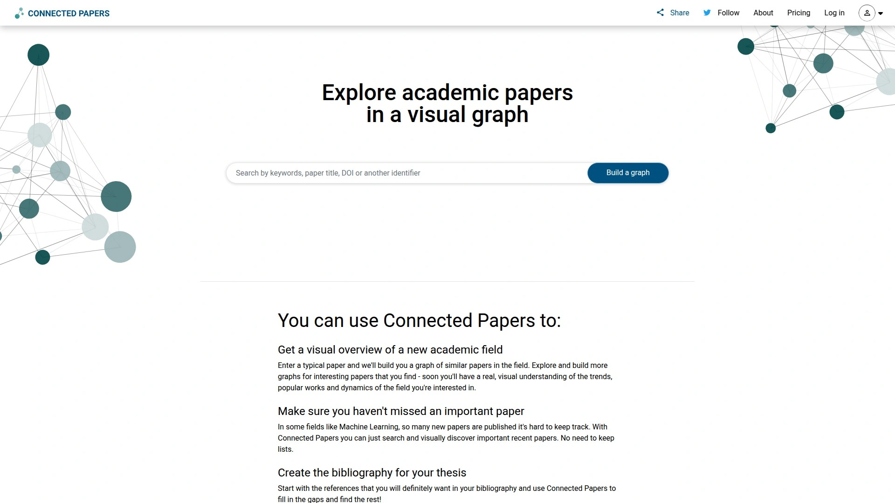

Connected Papers generates graphs showing how papers relate based on shared citations and references rather than just direct citation relationships. You enter a seed paper or keyword and get a visual web where bubble size represents citation count and color indicates publication year. This makes influential works and temporal patterns immediately visible without reading hundreds of abstracts.

The tool identifies clusters of similar papers even when they don't directly cite each other, helping you discover overlooked but relevant research. You can highlight all papers referencing or cited by specific works in your graph, building a comprehensive understanding of research lineages. Download references in .bib format for direct import into EndNote, Mendeley, or Zotero.

Integration with Semantic Scholar, Google Scholar, arXiv, and PubMed enables seamless navigation between platforms. Saved graphs let you track evolving literature for ongoing projects, and the visual interface makes literature exploration more intuitive than text-based lists. Free to use with account creation, making professional-grade literature mapping accessible to everyone.

***

## **[Zotero](https://www.zotero.org)**

Open-source reference manager that captures sources with one click, then organizes and cites them across Word, LibreOffice, and Google Docs.

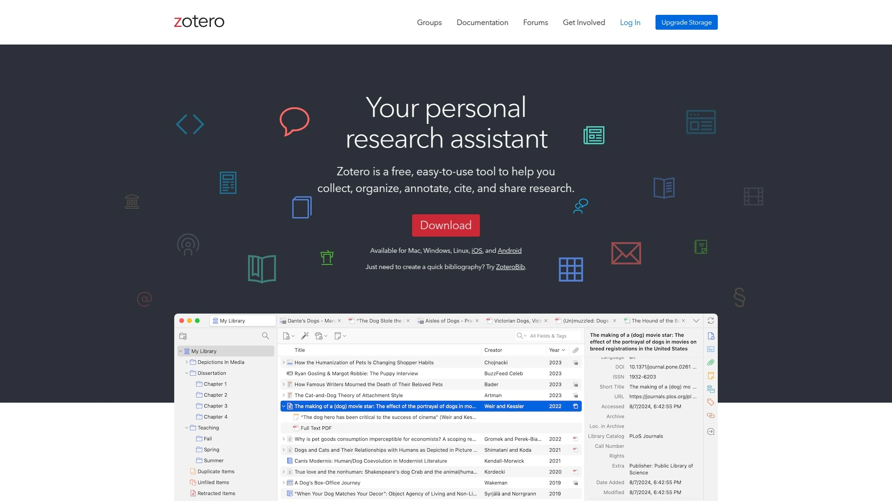

Zotero automatically detects research materials as you browse—articles from JSTOR, preprints from arXiv, news stories, books from libraries—and saves them with one click. You organize items into collections, tag them with keywords, or create saved searches that automatically populate as you work. The tool supports over 9,000 citation styles, formatting bibliographies to match any journal or style guide requirement.

Integration with Word processors lets you insert citations and generate bibliographies directly while writing, keeping references accurate and consistently formatted. Optional synchronization keeps your library accessible across devices and from any web browser. Collaboration features enable sharing libraries with colleagues, distributing course materials, or building group bibliographies at no cost.

AI plugins like A.R.I.A. (AI Research Assistant) extend Zotero with semantic search and analysis, letting you ask questions of your entire library and get context-based answers. The tool stays completely free and open-source, developed by a nonprofit with no financial interest in your data. Unlike commercial alternatives, you maintain full control of your research materials.

***

## **[Paperguide](https://paperguide.ai)**

Combines AI Research Assistant, Writer, and Reference Manager in one platform for end-to-end academic workflow support.

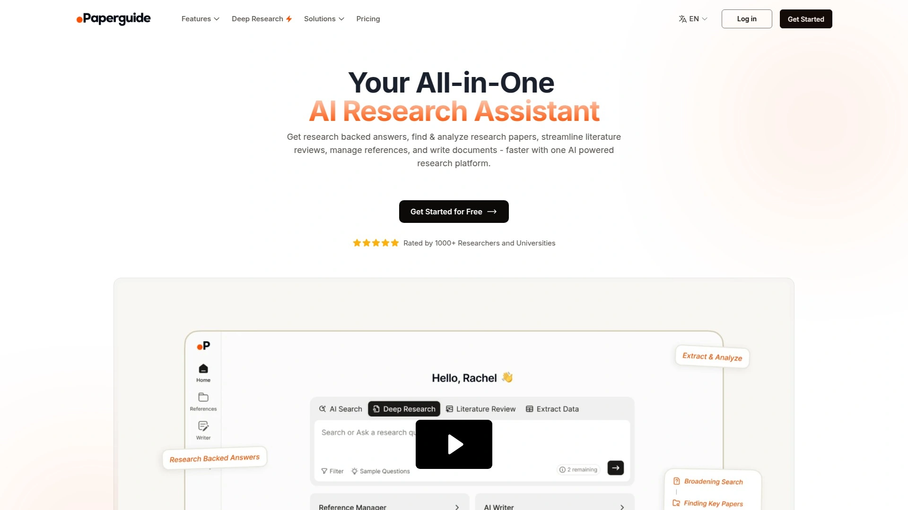

Paperguide's AI Research Assistant answers questions and reviews existing literature on your topic through the AI Search feature, providing analysis of top relevant papers with references and summaries. The Chat with PDF option extracts essential insights from individual papers, while Extract Data pulls specific information across multiple sources. The Literature Review tool fetches papers and generates detailed insights with customizable columns based on how you want to structure your work.

The AI Writer uses advanced algorithms to understand your paper's intent and provide suggestions that strengthen your arguments. Reference Manager keeps citations organized and easily accessible, automatically formatting them for your target publication. Compared to similar tools, Paperguide offers more research capabilities with greater freedom in free plans.

Validation features help you verify AI-generated responses against original sources before incorporating them into your writing. The platform handles the complete workflow from initial literature search through final citation formatting, reducing context-switching between multiple apps. Free Forever plan available with paid upgrades starting at $9 monthly.

***

## **[ResearchPal](https://researchpal.co)**

Generates literature reviews with authentic citations, finds in-text citations for your claims, and analyzes papers at superhuman speed.

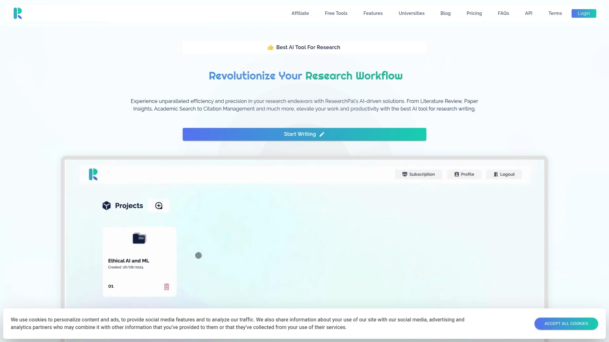

ResearchPal creates complete literature reviews from research questions in seconds using credible academic sources. The AI Essay Writer produces customized essays of any length with headings and authentic citations automatically included. You can rewrite text in different tones, adjust length, and work across multiple languages while maintaining academic standards.

The In-Text Citations feature finds authentic citations from credible journals for specific claims within seconds, eliminating hours of database searching. Reference Generator creates bibliographies in any format by adding paper titles or uploading PDFs. Paper Insights automates summarizing research, extracting methodology and contributions, or synthesizing findings from multiple sources.

Domain-specific search optimizes literature discovery by instantly saving relevant paper references and abstracts. The tool excels at automating repetitive research workflows that would otherwise consume days of manual effort. Users praise the ability to save searched papers and extract insights from their library within seconds.

---

## FAQ

**How do AI research assistants differ from regular search engines for academic work?**

AI research assistants understand semantic meaning and context rather than just matching keywords, so they find relevant papers even when terminology varies across studies. They extract and synthesize information from multiple sources automatically, generating summaries and structured data tables that would take hours to compile manually. Regular search engines return lists of links, while these tools provide answers with direct citations, compare findings across papers, and create visual maps of research relationships.

**Can these tools handle non-English research papers and sources?**

Many platforms support multilingual research workflows—SciSpace works across 13 languages, NotebookLM handles 50+ languages, and several tools provide translation features for technical concepts. You can interact with tools in your native language while accessing English research databases, or get explanations of foreign-language papers translated into your preferred language. The AI maintains citation accuracy across languages, though coverage of non-English academic databases varies by platform.

**Are the citations and data extractions from AI tools reliable enough for academic publication?**

Tools like Elicit provide sentence-level citations that link directly to source material, with data extraction accuracy reportedly exceeding human extractors in controlled tests. However, researchers should always verify AI-generated information against original sources before publication—use these tools to accelerate discovery and organization, not as final fact-checkers. Platforms designed specifically for academic workflows (like Consensus and Scite) focus on peer-reviewed sources and transparent citation practices to support reliable scholarship.

***

## Conclusion

The research process doesn't have to mean drowning in PDFs and juggling 50 browser tabs anymore. These AI assistants handle the grunt work—finding papers, extracting key points, mapping citations, and even drafting sections—so you can focus on the analysis and insights that actually matter. Each tool excels at different aspects of the workflow, from visualization to summarization to comprehensive writing support.

For researchers, students, and analysts managing complex projects across multiple sources, **[Otio](https://otio.ai)** delivers the complete pipeline in one workspace. It's built specifically for situations where you need to synthesize information from videos, papers, and web sources into coherent written output—without the constant copy-pasting between disconnected tools. When your research involves hundreds of sources and tight deadlines, having everything integrated saves more time than any individual feature could.

[24](https://skywork.ai/skypage/en/Elicit-AI-Review-(2025):-The-Ultimate-Guide-to-the-AI-Research-Assistant/1974387953557499904)
